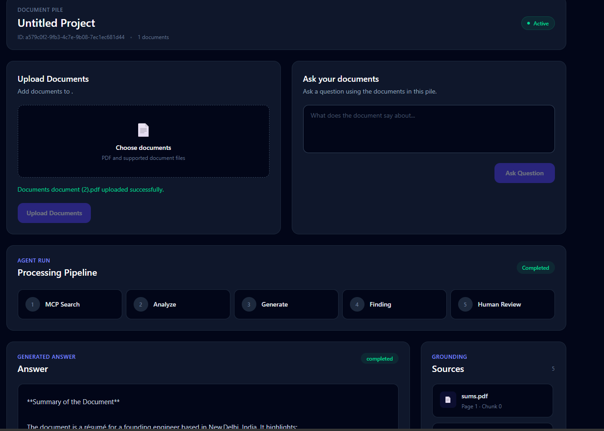
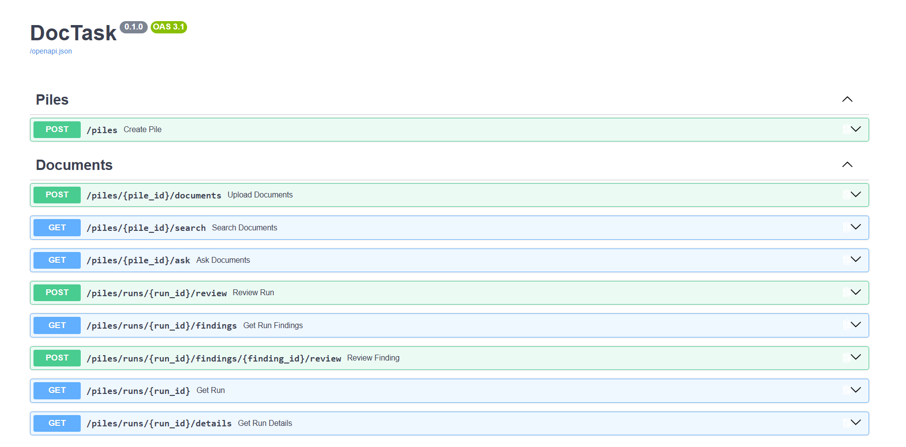
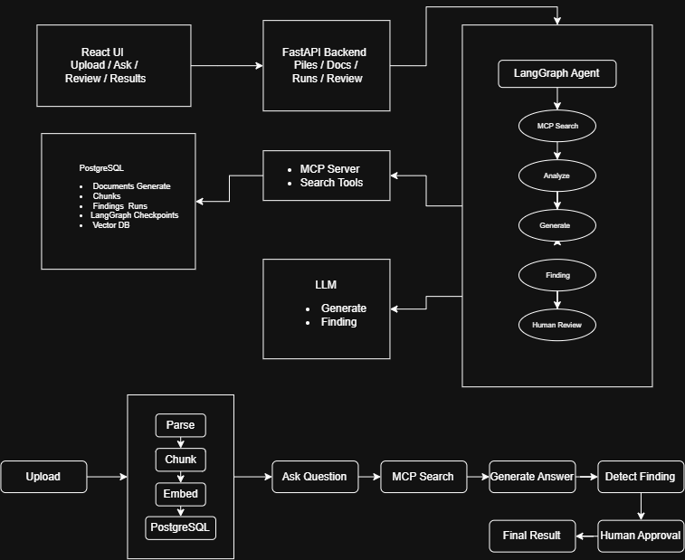

# SuperDocs — AI Document Analyst

An agentic document-analysis system built for the SuperDocs engineering task.

The system accepts a collection of related documents, retrieves relevant evidence, generates a grounded answer, detects contradictions, and pauses for human approval before completing the run.

## Architecture

```text
                         ┌─────────────────────┐
                         │      React UI       │
                         │ Upload / Ask /       │
                         │ Review / Results     │
                         └──────────┬──────────┘
                                    │ HTTP
                                    ▼
                         ┌─────────────────────┐
                         │   FastAPI Backend   │
                         │                     │
                         │ Piles / Documents   │
                         │ Ask / Runs / Review │
                         └──────────┬──────────┘
                                    │
                                    ▼
                    ┌──────────────────────────────┐
                    │       LangGraph Agent        │
                    │                              │
                    │ MCP Search → Analyze         │
                    │ → Generate → Finding         │
                    │ → Human Review               │
                    └───────┬──────────────┬───────┘
                            │              │
                            ▼              ▼
                 ┌────────────────┐   ┌─────────────┐
                 │   PostgreSQL   │   │     LLM     │
                 │                │   │             │
                 │ Documents      │   │ Answer      │
                 │ Chunks         │   │ Finding     │
                 │ Runs           │   └─────────────┘
                 │ Findings       │
                 │ Vector Search  │
                 │ Checkpoints    │
                 └────────────────┘
                            ▲
                            │
                    ┌───────┴────────┐
                    │   MCP Server   │
                    │ Machine access │
                    └────────────────┘
```

## Core Flow

```text
Create Pile
    ↓
Upload Documents
    ↓
Parse + Chunk + Embed
    ↓
Store in PostgreSQL
    ↓
User asks a question
    ↓
MCP document search
    ↓
Analyze retrieved evidence
    ↓
Generate grounded answer
    ↓
Detect contradictions / findings
    ↓
Human Review
    ↓
Approve / Reject
    ↓
Final Result
```

## Features

* Create document piles
* Upload multiple documents
* Document parsing and chunking
* Vector-based document retrieval
* MCP-based document search
* LangGraph agent orchestration
* Grounded answer generation
* Source/citation information
* Document contradiction detection
* Human-in-the-loop review
* Approve / reject workflow
* PostgreSQL-backed run state
* LangGraph PostgreSQL checkpointing
* Run isolation for concurrent executions
* Stage-level timing information
* LLM token usage tracking
* Prompt-injection-aware document processing
* React review interface

## Agent Stages

The agent is implemented as a multi-stage LangGraph workflow:

```text
START
  ↓
MCP Search
  ↓
Analyze
  ↓
Generate
  ↓
Finding
  ↓
Human Review
  ↓
END
```

The analysis stage decides whether enough relevant context exists to generate an answer.

If relevant context is unavailable, the system does not fabricate an answer.

## Human Review

The final stage uses a LangGraph interrupt.

The agent pauses before completion and presents the generated result and findings to the user.

The user can:

* Approve the result
* Reject the result

The frontend exposes this workflow through the review interface.

## Backend Stack

* Python
* FastAPI
* LangGraph
* SQLAlchemy
* PostgreSQL
* pgvector
* AsyncPG
* MCP
* LLM API

## Frontend Stack

* React
* Vite
* JavaScript
* Tailwind CSS
* Axios

## Project Structure

```text
superdocs/
│
├── backend/
│   ├── app/
│   │   ├── agents/
│   │   ├── api/
│   │   ├── models/
│   │   ├── services/
│   │   └── ...
│   │
│   ├── test/
│   ├── requirements.txt
│   └── README.md
│
├── frontend/
│   ├── src/
│   │   ├── api/
│   │   ├── components/
│   │   ├── context/
│   │   └── ...
│   │
│   └── package.json
│
├── README.md
└── .gitignore
```

## Running the Backend

From the backend directory:

```bash
python -m venv .venv
```

Activate the virtual environment.

Windows:

```powershell
.venv\Scripts\Activate.ps1
```

Install dependencies:

```bash
pip install -r requirements.txt
```

Configure the required environment variables in `.env`.

Start the API:

```bash
uvicorn app.main:app --reload
```

## Running the Frontend

From the frontend directory:

```bash
npm install
npm run dev
```

The frontend communicates with the FastAPI backend through Axios.

## Testing

Run the backend test suite:

```bash
pytest -q
```

The test suite covers important system behaviors including:

* Agent behavior
* Finding response validation
* Concurrent run isolation
* Security / prompt-injection behavior
* API/service behavior

## Observability

Each run records timing information for individual stages, for example:

```json
{
  "stages": {
    "mcp_search": {
      "duration_ms": 31782.94
    },
    "generate": {
      "duration_ms": 1000.94
    },
    "finding": {
      "duration_ms": 681.12
    }
  },
  "total_duration_ms": 33934.36
}
```

LLM usage is also captured for the model calls.

## Design Decisions

### LangGraph

LangGraph was used to represent the agent as an explicit stateful workflow rather than a single LLM call.

This provides:

* Explicit stages
* Conditional routing
* Interrupts
* Persistent checkpoints
* Resumability

### PostgreSQL

PostgreSQL provides persistent application data and vector retrieval while also supporting persistent LangGraph checkpoints.

This avoids relying on process-local state.

### MCP

MCP provides a machine-oriented interface for document operations and allows the agent workflow to interact with document search through a defined tool interface.

### Human-in-the-loop

Human review is implemented as an actual graph interrupt rather than only a frontend confirmation dialog.

## Limitations

* Document extraction quality depends on the source document and parser.
* LLM-generated answers depend on the quality of retrieved context.
* The current UI is focused on demonstrating the review workflow rather than being a production document-management interface.
* Large document collections would require additional optimization for retrieval and ingestion performance.

## Screenshots

### Main Application





### API / Postman




### Architecture



## Assignment

This project was built as part of the SuperDocs Engineering Task.

The implementation focuses on an agentic document-analysis workflow with persistent state, retrieval, findings, human review, MCP interaction, and observability.

## Author

MD Arman

Built for the SuperDocs Engineering Task.
